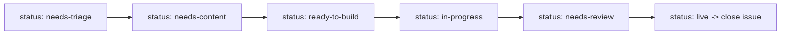

# Workstream Playbook — Website Updates & Downstream Handoffs

This is how the seven PharmaDS 2027 workstreams and the website maintainer collaborate through GitHub
Issues. Every website change starts as an issue, moves through a clear status, and — once live — hands
off any downstream activities (like an Outreach LinkedIn post) as new, linked issues.

## The seven workstreams

| Workstream | Owns (pages / area) | Label |
| --- | --- | --- |
| Conference Venue | `venue` (venue, dates, budget) | `ws: venue` |
| Theme & Session Planning | `program`, `short-courses`, home theme/agenda topics | `ws: theme-session` |
| Speaker & Instructor Invitation | `program` (keynote/speakers), `short-courses` (instructors), `committee` | `ws: speakers` |
| Conference Website | **all pages** — builds & ships every change | `ws: website` |
| Advertising & Outreach | home hero + newsletter, `community`, external LinkedIn | `ws: outreach` |
| Sponsorship | `partnership` | `ws: sponsorship` |
| 2028 Venue Research | internal report (no live page) | `ws: 2028-venue` |

## How to request a website update

1. Open a new issue and pick a template:
   - **📝 Website Content Update** — change copy/assets on a page (the main one).
   - **💡 Topic / Feedback** — an early idea before final copy exists.
   - **🎨 Formatting / Styling Fix** — how a page looks (color, layout, spacing).
   - **🔗 Downstream Activity** — a follow-up your workstream runs after a change goes live.
2. Fill in the workstream, target page(s), the exact change, and any formatting/color notes.
3. Submit. It lands with `status: needs-triage` for the website maintainer.

Blank issues are disabled so every request has the info the website team needs.

## Request lifecycle (open = pending, closed = done)

An issue stays **open** until the change is **live**. The `status:` label shows exactly where it is:



- **needs-triage** — new, maintainer hasn't reviewed.
- **needs-content** — waiting on final copy/assets from the requesting workstream.
- **ready-to-build** — content is final; website team can start.
- **in-progress** — website team is building (Netlify PR preview available).
- **needs-review** — built; requesting workstream signs off.
- **live** — shipped. **Close the issue.** Closed = live/handled.

The maintainer also applies the requesting `ws:` label and a `priority:` label at triage.

## Downstream triggers (what happens once a page is live)

When a change ships, open a **🔗 Downstream Activity** issue for each follow-up and set its
**Triggered by** field to the original issue number. This keeps follow-up work visible even after the
original request is closed.

| Website milestone goes live | Downstream activity | Owner |
| --- | --- | --- |
| Registration portal opens (`registration`) | LinkedIn "registration open" post + reminders; newsletter blast | `ws: outreach` |
| Registration portal opens (`registration`) | Notify sponsors/prospects registration is live | `ws: sponsorship` |
| Call for presentations opens (`call-for-presentations`) | CfP announcement post; promote tracks | `ws: outreach`, `ws: theme-session` |
| Venue + dates confirmed (`venue`) | "Save the date" post + newsletter | `ws: outreach` |
| Sponsors confirmed (`partnership`) | Refresh partner logos/wall; welcome/thank-you posts | `ws: website`, `ws: outreach` |
| Committee roster published (`committee`) | Announce organizing team | `ws: outreach` |
| Short courses finalized (`short-courses`) | Promote course lineup + instructors | `ws: outreach`, `ws: speakers` |

## Track requests

Ready-made searches (replace nothing — these work as-is on the repo Issues tab):

- All open requests: [`is:issue is:open`](../../issues?q=is%3Aissue+is%3Aopen)
- Open content updates: [`is:open label:"type: content"`](../../issues?q=is%3Aissue+is%3Aopen+label%3A%22type%3A+content%22)
- Open for a workstream (Outreach example): [`is:open label:"ws: outreach"`](../../issues?q=is%3Aissue+is%3Aopen+label%3A%22ws%3A+outreach%22)
- Waiting on content: [`is:open label:"status: needs-content"`](../../issues?q=is%3Aissue+is%3Aopen+label%3A%22status%3A+needs-content%22)
- Ready to build: [`is:open label:"status: ready-to-build"`](../../issues?q=is%3Aissue+is%3Aopen+label%3A%22status%3A+ready-to-build%22)
- Recently shipped: [`is:closed label:"status: live"`](../../issues?q=is%3Aissue+is%3Aclosed+label%3A%22status%3A+live%22)
- Downstream follow-ups: [`label:"type: downstream"`](../../issues?q=is%3Aissue+label%3A%22type%3A+downstream%22)

> A GitHub **Project** board (columns per `status:`) is an optional future add-on if the team wants a
> kanban view — not required for this workflow.

## Avoiding duplicates

Every template requires confirming you searched **open and closed** issues first, and GitHub suggests
similar issues as you type the title. If your idea already exists, add a 👍 or comment there instead of
opening a new issue.

## Labels

Labels are defined in [`.github/labels.yml`](./labels.yml). Create/update them in the repo with:

```bash
bash scripts/setup-labels.sh
```

Groups: `ws:` (workstream), `type:` (content / topic / formatting / downstream),
`status:` (lifecycle above), and `priority:` (high / medium / low).
